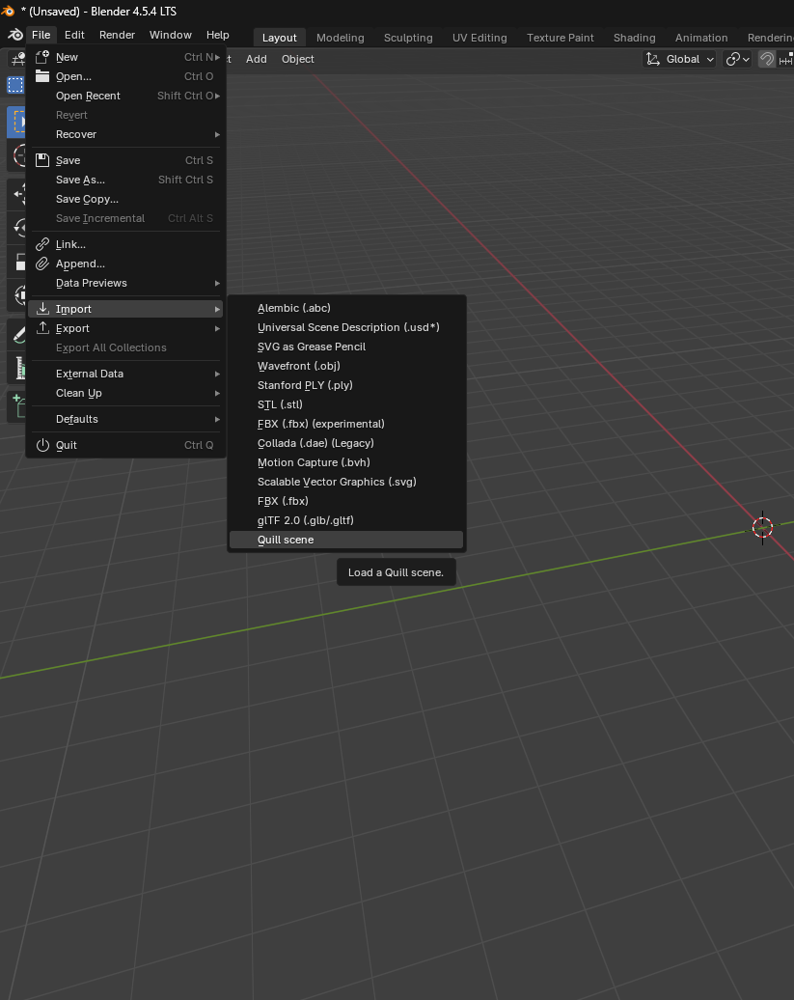
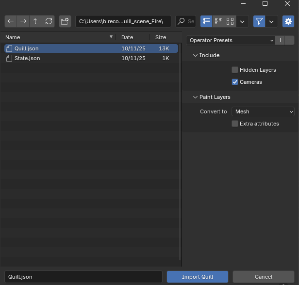
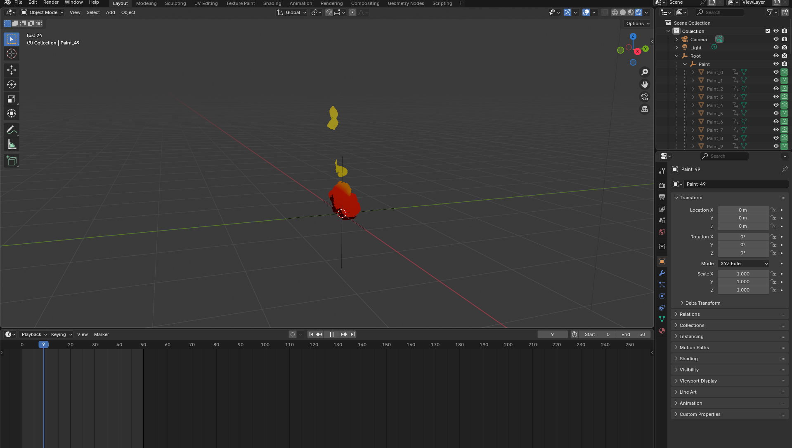

# Quill2Glb

Procedure and script to turn a Quill (VR drawing app) animation into a glb file

See the AR example of a simple fire animation made by Camille Lapelerie


# Import quill into blender

Use this addon : https://github.com/JoanCharmant/quill-blender

That is :

- Download latest release : https://github.com/JoanCharmant/quill-blender/releases
- Install into blender
    - Edit -> Preferences
    - GoTo Addon tab, and install from Disk
    - Blender addon screen
        .
    - Select the zip file
- Import Quill scene (use quill_scene_fire provided the first time)
    - Import from addon option
    
    - Import the json file from quill
    

It should look like this


# Use the script
(script developped with geminiii, in google ai studio)

In blender 
- go to Scripting tab
- click on new
- paste this python script
    ```py
    import bpy
    import os

    # ================= CONFIGURATION =================
    CONTAINER_NAME = "Paint"  #======= this is the base of your collection of quill objects
    EXPORT_NAME = r"put_export_path_here"
    # =================================================

    def robust_quill_bake():
        print(f"--- STARTING ROBUST BAKE FOR '{CONTAINER_NAME}' ---")

        # 1. Validation
        if CONTAINER_NAME not in bpy.data.objects:
            print(f"CRITICAL ERROR: Object '{CONTAINER_NAME}' not found.")
            return
        container = bpy.data.objects[CONTAINER_NAME]
        children = container.children
        if not children:
            print("CRITICAL ERROR: No children found.")
            return

        scene = bpy.context.scene
        start_frame = scene.frame_start
        end_frame = scene.frame_end
        
        # Storage for the animation data: { frame_number: [list_of_visible_object_names] }
        animation_map = {}

        # ========================================================
        # PHASE 1: READ (With Debug Printing)
        # ========================================================
        print(f"Phase 1: Scanning frames {start_frame} to {end_frame}...")
        
        for frame in range(start_frame, end_frame + 1):
            scene.frame_set(frame)
            # Force update dependency graph
            bpy.context.view_layer.update()
            
            visible_now = []
            for child in children:
                # Check Monitor Icon (hide_viewport) and Eye Icon (hide_get)
                # If EITHER is True, the object is hidden.
                is_hidden = child.hide_viewport or child.hide_get()
                
                if not is_hidden:
                    visible_now.append(child.name)
            
            animation_map[frame] = visible_now
            
            # Debug print (Check your Console!)
            if visible_now:
                print(f"  Frame {frame}: Visible -> {visible_now}")
            else:
                print(f"  Frame {frame}: [NO OBJECTS VISIBLE]")

        # ========================================================
        # PHASE 2: PREPARE (Reset Everything)
        # ========================================================
        print("Phase 2: Clearing old data and resetting scales...")
        
        for child in children:
            # Remove old visibility/scale animation
            child.animation_data_clear()
            # Default to INVISIBLE (Scale 0)
            child.scale = (0.0, 0.0, 0.0)
            # Ensure it shows in viewport as visible (so we can see the scale effect)
            child.hide_viewport = False 
            child.hide_render = False

        # ========================================================
        # PHASE 3: WRITE (Frame-by-Frame Injection)
        # ========================================================
        print("Phase 3: Writing new Scale keyframes...")
        
        for frame in range(start_frame, end_frame + 1):
            scene.frame_set(frame)
            
            visible_objects = animation_map.get(frame, [])
            
            for child in children:
                # Determine target scale for this specific frame
                if child.name in visible_objects:
                    target_scale = (1.0, 1.0, 1.0)
                else:
                    target_scale = (0.0, 0.0, 0.0)
                
                # Apply and Keyframe
                child.scale = target_scale
                child.keyframe_insert(data_path="scale", index=-1)

        # ========================================================
        # PHASE 4: INTERPOLATION FIX
        # ========================================================
        print("Phase 4: Setting Constant Interpolation...")
        for child in children:
            if child.animation_data and child.animation_data.action:
                for fcurve in child.animation_data.action.fcurves:
                    for kf in fcurve.keyframe_points:
                        kf.interpolation = 'CONSTANT'

        print("Baking Complete.")
        export_glb_final()

    def export_glb_final():
        blend_path = bpy.data.filepath
        directory = os.path.dirname(blend_path)
        if not directory: directory = "C:/tmp"
        target_file = os.path.join(directory, EXPORT_NAME)
        
        print(f"Exporting to {target_file}...")

        bpy.ops.object.select_all(action='DESELECT')
        container = bpy.data.objects[CONTAINER_NAME]
        container.select_set(True)
        for child in container.children:
            child.select_set(True)

        bpy.ops.export_scene.gltf(
            filepath=target_file,
            export_format='GLB',
            use_selection=True,
            export_yup=True,
            export_animations=True,
            export_anim_single_armature=False,
            export_frame_range=True,
            export_force_sampling=True, 
            export_def_bones=False,
            # Optimize size, but keep precision
            export_optimize_animation_size=True 
        )
        print("Export Finished.")

    # Run
    robust_quill_bake()
    ```
- Change the object collection (if it doesn't match your scene)
- Change your export path to the one you want. (keep the 'r' in front)
- You should get a nice glb 7Mo if you use the provided quill sene, it may come in way bigger sizes

# Test

- Drag and drop it here : https://gltf-viewer.donmccurdy.com/
- Go to animation
- click on play all

If you know about aframe here is the code for the first demo :

```html
<!DOCTYPE html>
<html>

<head>
  <title>Test glb anim</title>
  <script src="https://aframe.io/releases/1.6.0/aframe.min.js"></script>
  <script src="https://raw.githack.com/AR-js-org/AR.js/master/aframe/build/aframe-ar.js"></script>
  <script src="https://cdn.jsdelivr.net/gh/donmccurdy/aframe-extras@v6.1.1/dist/aframe-extras.min.js"></script>
</head>

<body>
  <a-scene embedded
    arjs="sourceType: webcam; detectionMode: mono_and_matrix; matrixCodeType: 3x3; trackingMethod: best ; changeMatrixMode: modelViewMatrix;"
    renderer="sortObjects: true; antialias: true; colorManagement: true; logarithmicDepthBuffer: true;"
    vr-mode-ui="enabled: false" smooth=" true" smoothCount="5" smoothTolerance=".05" smoothThreshold="5"
    sourceWidth="800" sourceHeight="600" displayWidth="1280" displayHeight="720">

    <a-assets>
      <a-asset-item id="model" src="./quill.glb"></a-asset-item>
    </a-assets>


    <a-marker type='barcode' value='0'>
  
        <a-entity scale=".5 .5 .5" rotation="270 0 0" gltf-model="#model" animation-mixer></a-entity>
      
    </a-marker>

    <a-entity camera></a-entity>
  </a-scene>
</body>

</html>
```
Have fun !
